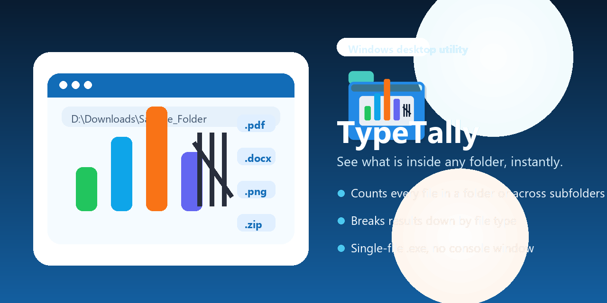

# TypeTally

TypeTally is a Windows desktop app that scans a folder and shows how many files it contains, with a clear breakdown by file type.

It is useful when you want quick answers to questions like:

- How many PDFs are in this folder?
- What file types are mixed into this download?
- What is actually inside this shared folder before I sort it manually?

## What it does

- Counts files in a selected folder
- Groups results by extension such as `.pdf`, `.docx`, `.jpg`, and `.zip`
- Optionally includes files from subfolders
- Shows the results in a simple desktop interface

## Download

- Download the latest build from the GitHub Releases page.
- Direct package in this repository: [`release/TypeTally-Windows-x64.zip`](release/TypeTally-Windows-x64.zip)

1. Open the latest GitHub Release
2. Download `TypeTally-Windows-x64.zip`
3. Extract it
4. Run `TypeTally.exe`

## Use cases

- Checking student submission folders before review
- Looking through large download folders with mixed file types
- Inspecting shared work folders before cleanup or archiving
- Getting a quick inventory of documents, images, and other files without using the command line

## License

MIT
